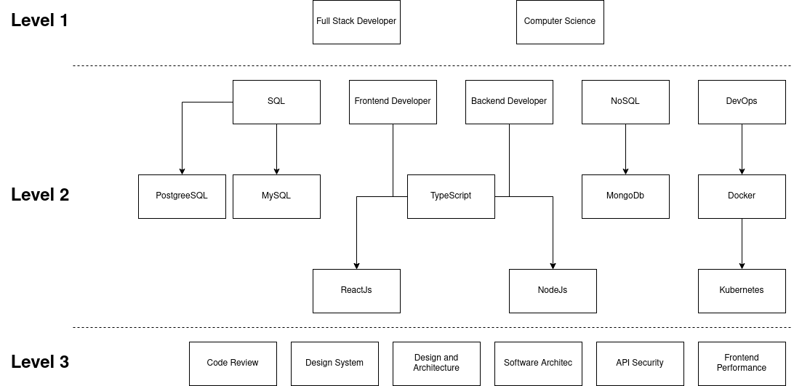

# My Code Diary

Starting from my frustration of feeling that my software development skills are stagnant and not progressing, I have decided to create this repository.
 
This is a personal roadmap, aimed at achieving a deeper understanding of software engineering. The learning path is based on my personal observations, with the assistance of <a href="https://www.roadmap.sh">roadmap.sh</a>, which clearly outlines the learning journey based on the experiences of various individuals in the software engineering community.
 
Within this repository, I will document all my progress in software engineering learning, as well as the projects I work on during the learning process.
 
I hope that this will be beneficial in improving my software development skills, both in the short, medium, and long term.

## Roadmap

Here is the roadmap I created based on my observations:

In the initial stage, I aim to learn the fundamentals of computer science and implement them in my projects as a full-stack developer.
 
Next, I want to dive deeper into web development, including frontend development, backend development, databases, and even DevOps.
 
Once I have a good understanding of how to create software projects effectively, I want to further explore how software should be designed, including design systems, architecture, and more.

### Progress

1. Level 1

| Learning              | Progress | Link Github |
| --------------------- | -------- | ----------- |
| Fullstack Development | 0 %      |             |
| Computer Science      | 0 %      |             |

2. Level 2

| Learning             | Progress | Link Github |
| -------------------- | -------- | ----------- |
| Typescript           | 0 %      |             |
| Backend Development  | 0 %      |             |
| NodeJs               | 0 %      |             |
| Typescript           | 0 %      |             |
| Frontend Development | 0 %      |             |
| ReactJs              | 0 %      |             |
| SQL                  | 0 %      |             |
| PostgreSQL           | 0 %      |             |
| MySQL                | 0 %      |             |
| NoSQL                | 0 %      |             |
| MongoDb              | 0 %      |             |
| DevOps               | 0 %      |             |
| Docker               | 0 %      |             |
| Kubernetes           | 0 %      |             |

3. Level 3

| Learning                | Progress | Link Github |
| ----------------------- | -------- | ----------- |
| Code Review             | 0 %      |             |
| Design System           | 0 %      |             |
| Design and Architecture | 0 %      |             |
| Software Architec       | 0 %      |             |
| API Security            | 0 %      |             |
| Frontend Performance    | 0 %      |             |
